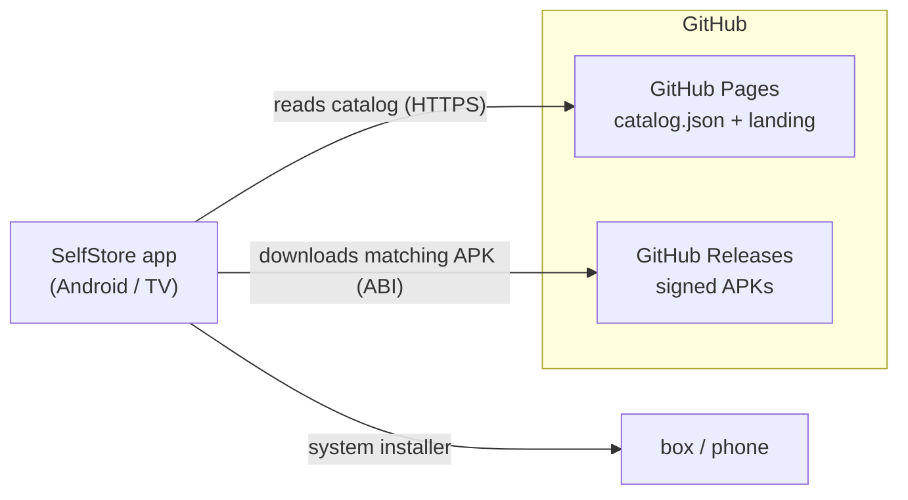

<div align="center">


# SelfStore

**Your own app store for all Self projects — without Google Play.**

Install and update your self-hosted apps right on phone & TV box.

[](https://github.com/s3lfcod3r/selfstore/releases/latest)
[](https://s3lfcod3r.github.io/selfstore/)


[**Open store**](https://s3lfcod3r.github.io/selfstore/) · [Apps](#-included-apps) · [Install](#-install-on-the-tv-box) · [Add an app](#-add-an-app-to-the-store) · [Security](#-security)

🌐 [Deutsch](README.md) · **English**

</div>

---

## What is SelfStore?

SelfStore is a **lean, self-hosted app store** exclusively for the **Self projects**
(SelfMailer, SelfAuthenticator, SelfDashboard, …). A native Android app reads a fixed
catalog from GitHub Pages and installs/updates the apps directly – ideal for **TV
boxes** that have no Google Play, or where it isn't wanted.

> **SelfStream Player** is intentionally **not** included.

This repository provides the **server side** (catalog + bootstrap landing page) via
GitHub Pages. The Android app's source code lives separately.

## ✨ Features

- 📦 **One fixed store** – only your own Self apps, no third-party repos.
- 🔄 **Update detection** – shows *Install · Open · Update* per device state.
- 📺 **TV-ready** – appears on the Android TV home (Leanback), remote-friendly.
- 🧩 **armv7 + armv8** – automatically picks the right APK per box.
- 🌐 **No own server needed** – catalog + APKs run entirely on GitHub.
- 🎨 **Self branding** – consistent Self look (teal, dark).

## 📲 Included apps

The current list lives in [`catalog.json`](catalog.json) and is live at
**<https://s3lfcod3r.github.io/selfstore/catalog.json>**.

| App | Purpose |
|-----|---------|
| **SelfStore** | The store itself (self-update) |
| **SelfMailer** | Self-hosted mail client (IMAP/POP3/SMTP, calendar) |
| **SelfAuthenticator** | Zero-knowledge 2FA / TOTP vault |
| **SelfDashboard** | Central overview of your Self services |

## 🚀 Install on the TV box

1. Allow **"install unknown apps"** on the box (Settings → Security, or confirm later
   during install).
2. Install the **"Downloader"** app (by AFTVnews) from the box's store.
3. In Downloader, open this address: **`store.selfcoder.de`**
4. Download and install the **SelfStore APK**.
5. Open SelfStore → all Self apps are ready to install / update.

## 🏗️ Architecture



- **Catalog** = static `catalog.json` (this repo, via GitHub Pages).
- **Delivery** = APKs as **GitHub release assets** per app repo.
- **Client** = native Compose app, picks the right APK via `Build.SUPPORTED_ABIS`.

## 📁 Repository contents

```
selfstore/
├── catalog.json     # app list (source of truth)
├── index.html       # bootstrap landing page (Self look)
├── app.js           # landing logic (renders the catalog XSS-safe)
├── icons/           # app icons (512×512, dark Self background)
└── .nojekyll        # GitHub Pages: serve files as-is
```

## ➕ Add an app to the store

Append a block in [`catalog.json`](catalog.json) → `apps`:

```json
{
  "id": "com.example.app",
  "name": "SelfExample",
  "tagline": "Short description",
  "description": "Longer text …",
  "icon": "icons/self-example.png",
  "category": "Tools",
  "author": "SelfCoder",
  "versionName": "1.0.0",
  "versionCode": 1,
  "apk": "https://github.com/s3lfcod3r/<repo>/releases/download/v1.0.0/<file>.apk"
}
```

> ⚠️ **`id` MUST be the real `applicationId`** of the app, otherwise update detection
> won't work. When unsure, read it from the APK:
> `aapt dump badging <app>.apk | findstr package`.
> Bump `versionCode` on **every** update.

### armv7 / armv8

- **Apps without native code** (WebView wrappers, pure Compose apps): a single
  **universal APK** in the `apk` field is enough — runs on armv7 **and** armv8.
- **Apps with native libs** (`.so`): use the `abis` field instead of `apk`:

```json
"abis": {
  "armeabi-v7a": "https://…/app-armeabi-v7a.apk",
  "arm64-v8a":   "https://…/app-arm64-v8a.apk"
}
```

### Release convention (APK file names)

Upload **two assets** per release:

- **`<App>-v<Version>.apk`** (versioned) — linked in the catalog, consistent with the
  other Self apps.
- **`selfstore.apk`** (stable name, this repo only) — so the bootstrap link
  `…/releases/latest/download/selfstore.apk` always works.

> `latest/download/<name>` only works with a **stable** file name; link versioned
> files via `releases/download/<tag>/<file>`.

### 🤖 Automatic catalog sync

A GitHub workflow ([`.github/workflows/sync-catalog.yml`](.github/workflows/sync-catalog.yml))
keeps the **versions of existing apps** up to date automatically: it periodically
(every 6 h, or manually via *Run workflow*) reads the latest release of each app repo,
pulls `versionCode`/`versionName`/`applicationId` straight from the release APK and
updates `catalog.json`.

Requirement per entry: a **`"source": "<owner>/<repo>"`** field (ignored by the app).
So for updates: **build APK → upload release → done** — the catalog follows on its own.

> **New apps** still have to be added **once by hand** (name, description, icon, correct
> `id`/`applicationId`, `source`). After that their version updates run automatically.

## 🔧 Build the Android app

Build via the bundled toolchain (no Android Studio needed):

```powershell
$env:JAVA_HOME    = "F:\09_Cloude\Github SelfCoder\Android\jdk21"
$env:ANDROID_HOME = "F:\09_Cloude\Github SelfCoder\Android\sdk"
& "F:\09_Cloude\Github SelfCoder\Android\gradle-8.10.2\bin\gradle.bat" `
    -p "F:\09_Cloude\Github SelfCoder\Android\selfstore-app" `
    :app:assembleRelease --no-daemon --console=plain
```

→ `app/build/outputs/apk/release/app-release.apk` (release-signed if
`keystore.properties` exists; otherwise debug fallback).

## 🔒 Security

A security review (ECC `security-reviewer`) was performed. **Hardening applied:**

- **Transport:** the app loads catalog, APKs and icons **over HTTPS only** and only
  from allowed hosts (`github.com`, `github.io`, `githubusercontent.com`). Tampered
  catalog URLs pointing to foreign servers are rejected.
- **Landing page:** catalog rendering is **XSS-safe** (`textContent` instead of
  `innerHTML`), `https:`-only links, strict **Content-Security-Policy**
  (`script-src 'self'`), `referrer: no-referrer`.
- **App manifest:** `allowBackup=false`, FileProvider limited to `cache/downloads` and
  not exported, no cleartext (Android default since targetSdk 28).
- **Error output:** internal details only to the log, generic messages to the user.

**Knowingly accepted / roadmap:**

- 🔜 **Signature pinning** of installed APKs against known SelfCoder signers (strongest
  protection against repo compromise) — planned.
- 🔜 **SHA-256 per catalog entry** for post-download integrity checks.
- ℹ️ `QUERY_ALL_PACKAGES` is legitimate for a store (app isn't distributed via Play).
- ℹ️ Keystore/passwords stay **local only** and are in `.gitignore` — never in the repo.

Found a security issue? Please report it privately / directly to SelfCoder, not in
public.

## 🌐 Enable GitHub Pages (one-time)

Settings → **Pages** → Source: `Deploy from a branch`, branch `main` / `/ (root)`.
Live after ~1 min at `https://s3lfcod3r.github.io/selfstore/`.

> The app is hard-wired to `…/selfstore/catalog.json` (`CATALOG_URL` in `Catalog.kt`).
> Different path → adjust it there.

---

<div align="center">
<sub>Part of the <b>Self</b> ecosystem · © SelfCoder</sub>
</div>
