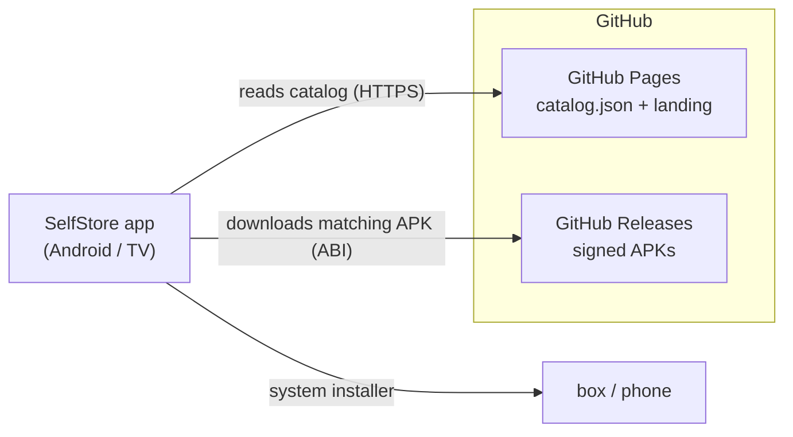

<div align="center">


# SelfStore

**Your own app store for all Self projects — without Google Play.**

Install and update your self-hosted apps right on phone & TV box.

[](https://github.com/s3lfcod3r/selfstore/releases/latest)
[](https://s3lfcod3r.github.io/selfstore/)


[](LICENSE)

[**Open store**](https://s3lfcod3r.github.io/selfstore/) · [Apps](#-included-apps) · [Install](#-install-on-the-tv-box) · [Add an app](#-add-an-app-to-the-store) · [Security](#-security)

🌐 [Deutsch](README.md) · **English**

</div>

---

## What is SelfStore?

SelfStore is a **lean, self-hosted app store** exclusively for the **Self projects**
(SelfMailer, SelfAuthenticator, SelfDashboard, …). A native Android app reads a fixed
catalog from GitHub Pages and installs/updates the apps directly – ideal for **TV
boxes** that have no Google Play, or where it isn't wanted.

> **SelfStream Player** is intentionally **not** included.

This repository provides the **server side** (catalog + bootstrap landing page) via
GitHub Pages. The Android app's source code is maintained separately and is not part
of this repo.

## ✨ Features

- 📦 **One fixed store** – only your own Self apps, no third-party repos.
- 🔄 **Update detection** – shows *Install · Open · Update* per device state.
- 📺 **TV-ready** – appears on the Android TV home (Leanback), remote-friendly.
- 🧩 **armv7 + armv8** – automatically picks the right APK per box.
- 🌐 **No own server needed** – catalog + APKs run entirely on GitHub.
- 🔒 **Custom sources** – add private app repos (e.g. NextCloud/WebDAV) with username + app password; credentials stored encrypted (Android Keystore), HTTPS only. → [guide](docs/EIGENE-QUELLEN.en.md)
- 🔗 **Add via web** – enter a source in the browser on your PC/phone (`store.selfcoder.de/pair`); the TV box picks it up automatically via a code — no typing on the remote. **End-to-end encrypted** (since v1.5.0): the two-part code `SLOT-KEY` sends only the slot to the service, leaving link and password unreadable to it. → [setup](docs/WEB-KOPPLUNG-SETUP.en.md)
- 📱 **Device filter** – on a TV only TV-capable apps are shown; phone-only apps stay hidden there (catalog field `platforms`).
- 🎨 **Self branding** – consistent Self look (teal, dark).

## 📲 Included apps

The current list lives in [`catalog.json`](catalog.json) and is live at
**<https://s3lfcod3r.github.io/selfstore/catalog.json>**.

| App | Purpose |
|-----|---------|
| **SelfStore** | The store itself (self-update) |
| **SelfMailer** | Self-hosted mail client (IMAP/POP3/SMTP, calendar) |
| **SelfAuthenticator** | Zero-knowledge 2FA / TOTP vault |
| **SelfDashboard** | Central overview of your Self services |

## 🚀 Install on the TV box

1. Allow **"install unknown apps"** on the box (Settings → Security, or confirm later
   during install).
2. Install the **"Downloader"** app (by AFTVnews) from the box's store.
3. In Downloader, open this address: **`store.selfcoder.de`**
4. Download and install the **SelfStore APK**.
5. Open SelfStore → all Self apps are ready to install / update.

## 🏗️ Architecture


```mermaid
flowchart LR
    subgraph GitHub
      P["GitHub Pages<br/>catalog.json + landing"]
      R["GitHub Releases<br/>signed APKs"]
    end
    A["SelfStore app<br/>(Android / TV)"]
    A -- "reads catalog (HTTPS)" --> P
    A -- "downloads matching APK (ABI)" --> R
    A -- "system installer" --> D["box / phone"]
```

- **Catalog** = static `catalog.json` (this repo, via GitHub Pages).
- **Delivery** = APKs as **GitHub release assets** per app repo.
- **Client** = native Compose app, picks the right APK via `Build.SUPPORTED_ABIS`.

## 📁 Repository contents

```
selfstore/
├── catalog.json              # app list (source of truth)
├── index.html                # bootstrap landing page (Self look)
├── app.js                    # landing logic (renders the catalog XSS-safe)
├── icons/                    # app icons (512×512, dark Self background)
├── tools/
│   └── sync_catalog.py       # auto-sync: pulls release versions into catalog.json
├── .github/workflows/
│   └── sync-catalog.yml      # workflow that runs the auto-sync every 6 h
├── LICENSE                   # MIT
└── .nojekyll                 # GitHub Pages: serve files as-is
```

## ➕ Add an app to the store

Append a block in [`catalog.json`](catalog.json) → `apps`:

```json
{
  "id": "com.example.app",
  "name": "SelfExample",
  "tagline": "Short description",
  "description": "Longer text …",
  "icon": "icons/self-example.png",
  "category": "Tools",
  "author": "SelfCoder",
  "versionName": "1.0.0",
  "versionCode": 1,
  "apk": "https://github.com/s3lfcod3r/<repo>/releases/download/v1.0.0/<file>.apk"
}
```

> ⚠️ **`id` MUST be the real `applicationId`** of the app, otherwise update detection
> won't work. When unsure, read it from the APK:
> `aapt dump badging <app>.apk | findstr package`.
> Bump `versionCode` on **every** update.

### armv7 / armv8

- **Apps without native code** (WebView wrappers, pure Compose apps): a single
  **universal APK** in the `apk` field is enough — runs on armv7 **and** armv8.
- **Apps with native libs** (`.so`): use the `abis` field instead of `apk`:

```json
"abis": {
  "armeabi-v7a": "https://…/app-armeabi-v7a.apk",
  "arm64-v8a":   "https://…/app-arm64-v8a.apk"
}
```

### Release convention (APK file names)

Upload **two assets** per release:

- **`<App>-v<Version>.apk`** (versioned) — linked in the catalog, consistent with the
  other Self apps.
- **`selfstore.apk`** (stable name, this repo only) — so the bootstrap link
  `…/releases/latest/download/selfstore.apk` always works.

> `latest/download/<name>` only works with a **stable** file name; link versioned
> files via `releases/download/<tag>/<file>`.

### 🤖 Automatic catalog sync

A GitHub workflow ([`.github/workflows/sync-catalog.yml`](.github/workflows/sync-catalog.yml))
keeps the **versions of existing apps** up to date automatically: it periodically
(every 15 min, on every release, and manually via *Run workflow*) reads the latest
release of each app repo, pulls `versionCode`/`versionName`/`applicationId` straight
from the release APK, computes its **SHA-256** and updates `catalog.json`. The app
verifies that hash before every installation.

Requirement per entry: a **`"source": "<owner>/<repo>"`** field (ignored by the app).
So for updates: **build APK → upload release → done** — the catalog follows on its own.

> **New apps** still have to be added **once by hand** (name, description, icon, correct
> `id`/`applicationId`, `source`). After that their version updates run automatically.

## 🔧 Build the Android app

Build via the bundled toolchain (no Android Studio needed):

```powershell
$env:JAVA_HOME    = "<TOOLCHAIN>\jdk21"
$env:ANDROID_HOME = "<TOOLCHAIN>\sdk"
& "<TOOLCHAIN>\gradle-8.10.2\bin\gradle.bat" `
    -p "<PATH-TO-APP>" `
    :app:assembleRelease --no-daemon --console=plain
```

→ `app/build/outputs/apk/release/app-release.apk` (release-signed if
`keystore.properties` exists; otherwise debug fallback).

## 🔒 Security

Last reviewed: **August 2026** (code **and** operations). **Hardening applied:**

- **Signature pinning (since v1.5.0):** an APK is installed only if it carries the
  expected signing key. The fingerprints live **inside the app** (`SignerPins.kt`),
  deliberately **not** in the catalog — anyone able to tamper with the catalog would
  simply change an expected value stored there. Apps without a pin (private sources)
  are checked against the signature of the already installed version.
- **Integrity before install:** package name **and** the catalog's SHA-256 are verified
  against the downloaded file; on mismatch it is deleted before the system installer
  ever sees it. The hash is maintained by the auto-sync.
- **Transport:** catalog, APKs and icons **over HTTPS only**, and only from allowed
  hosts (`github.com`, `github.io`, `githubusercontent.com`, your own source hosts).
  The address actually reached **after redirects** is re-checked, so redirects cannot
  bypass the allow-list.
- **End-to-end encrypted web pairing (since v1.5.0):** the TV shows `SLOT-KEY`; only
  the slot reaches the pairing service, while the key part travels solely through the
  user's eyes into the browser. There, link and password are encrypted with AES-256-GCM
  (PBKDF2-HMAC-SHA256, 200,000 rounds) — **the relay only ever sees ciphertext**.
  Unencrypted submissions are rejected.
- **Credentials for custom sources** are stored in `EncryptedSharedPreferences`
  (Android keystore), never in plaintext.
- **Supply chain:** the auto-sync job can write the catalog and the bootstrap APK, so
  GitHub Actions are pinned to **commit SHAs** and the Python dependencies are nailed
  down in `tools/requirements.txt` with `--require-hashes`; the repository's default
  workflow token is `read`.
- **Web pages:** catalog rendering is **XSS-safe** (`textContent` instead of
  `innerHTML`), `https:`-only links, a strict **CSP** with no inline script — including
  the pairing page where passwords are typed — and `referrer: no-referrer`.
- **App manifest:** `allowBackup=false`, FileProvider limited to `cache/downloads` and
  not exported, no cleartext, and **no** `QUERY_ALL_PACKAGES` (a narrow `<queries>` list
  instead, which also avoids Play Protect warnings).

**Knowingly accepted / roadmap:**

- ℹ️ The pairing service runs on Cloudflare — but with end-to-end encryption it is just
  a mailbox with no visibility. Its rate limit is per IP and not atomic.
- ℹ️ Keystore/passwords stay **local only** and are in `.gitignore` — never in the repo.
- ℹ️ GitHub Pages cannot set HTTP headers, so `frame-ancestors` is unavailable by design
  (a meta CSP cannot express it).

Found a security issue? Please report it privately / directly to SelfCoder, not in
public.

## 🌐 Enable GitHub Pages (one-time)

Settings → **Pages** → Source: `Deploy from a branch`, branch `main` / `/ (root)`.
Live after ~1 min at `https://s3lfcod3r.github.io/selfstore/`.

> The app is hard-wired to `…/selfstore/catalog.json` (`CATALOG_URL` in `Catalog.kt`).
> Different path → adjust it there.

---

<div align="center">
<sub>Part of the <b>Self</b> ecosystem · © SelfCoder</sub>
</div>
