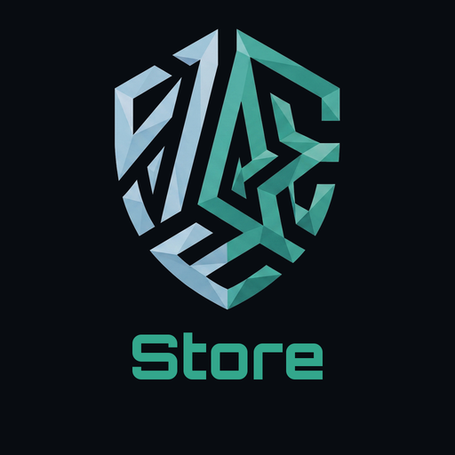
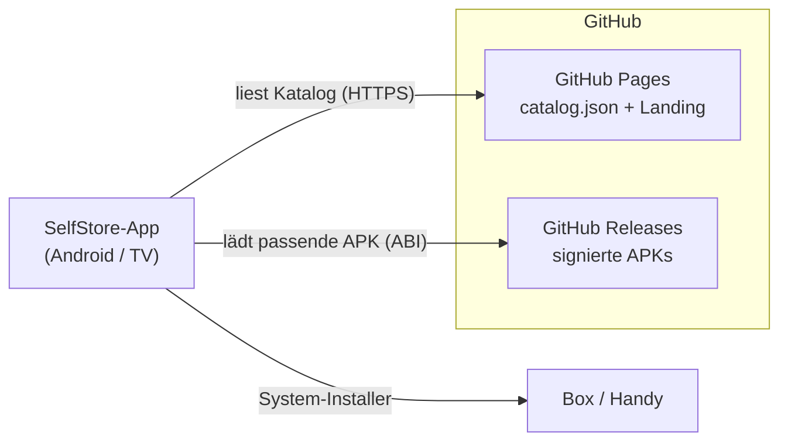

<div align="center">



# SelfStore

**Dein eigener App-Store für alle Self-Projekte — ohne Google Play.**

Installiere und aktualisiere deine self-hosted Apps direkt auf Handy & TV-Box.

[](https://github.com/s3lfcod3r/selfstore/releases/latest)
[](https://s3lfcod3r.github.io/selfstore/)


[**Store öffnen**](https://s3lfcod3r.github.io/selfstore/) · [Apps](#-enthaltene-apps) · [Installieren](#-installation-auf-der-tv-box) · [App hinzufügen](#-eine-app-in-den-store-legen) · [Security](#-security)

🌐 **Deutsch** · [English](README.en.md)

</div>

---

## Was ist SelfStore?

SelfStore ist ein **schlanker, selbst gehosteter App-Store** ausschließlich für die
**Self-Projekte** (SelfMailer, SelfAuthenticator, SelfDashboard, …). Eine native
Android-App liest einen festen Katalog von GitHub Pages und installiert bzw.
aktualisiert die Apps direkt – ideal für **TV-Boxen**, auf denen es kein Google Play
gibt oder gar nicht erwünscht ist.

> **SelfStream Player** ist bewusst **nicht** enthalten.

Dieses Repository liefert die **Server-Seite** (Katalog + Bootstrap-Landingpage) über
GitHub Pages. Der Quellcode der Android-App liegt separat.

## ✨ Features

- 📦 **Ein fester Store** – nur deine eigenen Self-Apps, keine Fremd-Repos.
- 🔄 **Update-Erkennung** – zeigt *Installieren · Öffnen · Aktualisieren* je Gerätelage.
- 📺 **TV-tauglich** – erscheint im Android-TV-Start (Leanback), per Fernbedienung bedienbar.
- 🧩 **armv7 + armv8** – wählt automatisch die passende APK je Box.
- 🌐 **Kein eigener Server nötig** – Katalog + APKs laufen komplett über GitHub.
- 🎨 **Self-Branding** – durchgängig im Self-Look (Teal, dark).

## 📲 Enthaltene Apps

Die aktuelle Liste steht in [`catalog.json`](catalog.json) und ist live unter
**<https://s3lfcod3r.github.io/selfstore/catalog.json>**.

| App | Zweck |
|-----|-------|
| **SelfStore** | Der Store selbst (self-update) |
| **SelfMailer** | Self-hosted Mail-Client (IMAP/POP3/SMTP, Kalender) |
| **SelfAuthenticator** | Zero-Knowledge 2FA-/TOTP-Tresor |
| **SelfDashboard** | Zentrale Übersicht über deine Self-Dienste |

## 🚀 Installation auf der TV-Box

1. Auf der Box **„Unbekannte Apps zulassen"** erlauben (Einstellungen → Sicherheit,
   bzw. später beim Installieren bestätigen).
2. Die App **„Downloader"** (von AFTVnews) aus dem Box-Store installieren.
3. In Downloader diese Adresse öffnen: **`s3lfcod3r.github.io/selfstore`**
4. **SelfStore-APK** herunterladen und installieren.
5. SelfStore öffnen → alle Self-Apps stehen zum Installieren / Aktualisieren bereit.

## 🏗️ Architektur



- **Katalog** = statisches `catalog.json` (dieses Repo, via GitHub Pages).
- **Auslieferung** = APKs als **GitHub-Release-Assets** je App-Repo.
- **Client** = native Compose-App, wählt per `Build.SUPPORTED_ABIS` die richtige APK.

## 📁 Repository-Inhalt

```
selfstore/
├── catalog.json     # App-Liste (Quelle der Wahrheit)
├── index.html       # Bootstrap-Landingpage (Self-Look)
├── app.js           # Landing-Logik (rendert den Katalog XSS-sicher)
├── icons/           # App-Icons (512×512, dunkler Self-Hintergrund)
└── .nojekyll        # GitHub Pages: Dateien unverändert ausliefern
```

## ➕ Eine App in den Store legen

Block in [`catalog.json`](catalog.json) → `apps` anhängen:

```json
{
  "id": "com.beispiel.app",
  "name": "SelfBeispiel",
  "tagline": "Kurzbeschreibung",
  "description": "Längerer Text …",
  "icon": "icons/self-beispiel.png",
  "category": "Tools",
  "author": "SelfCoder",
  "versionName": "1.0.0",
  "versionCode": 1,
  "apk": "https://github.com/s3lfcod3r/<repo>/releases/download/v1.0.0/<datei>.apk"
}
```

> ⚠️ **`id` MUSS die echte `applicationId`** der App sein, sonst funktioniert die
> Update-Erkennung nicht. Im Zweifel aus der APK auslesen:
> `aapt dump badging <app>.apk | findstr package`.
> `versionCode` bei **jedem** Update hochzählen.

### armv7 / armv8

- **Apps ohne Native-Code** (WebView-Wrapper, reine Compose-Apps): ein
  **Universal-APK** im Feld `apk` reicht — läuft auf armv7 **und** armv8.
- **Apps mit Native-Libs** (`.so`): statt `apk` das Feld `abis` nutzen:

```json
"abis": {
  "armeabi-v7a": "https://…/app-armeabi-v7a.apk",
  "arm64-v8a":   "https://…/app-arm64-v8a.apk"
}
```

### Release-Konvention (APK-Dateinamen)

Pro Release **zwei Assets** hochladen:

- **`<App>-v<Version>.apk`** (versioniert) — wird im Katalog verlinkt, einheitlich
  mit den anderen Self-Apps.
- **`selfstore.apk`** (stabiler Name, nur dieses Repo) — damit der Bootstrap-Link
  `…/releases/latest/download/selfstore.apk` immer funktioniert.

> `latest/download/<name>` klappt nur mit **stabilem** Dateinamen; versionierte
> Dateien per `releases/download/<tag>/<datei>` verlinken.

### 🤖 Automatischer Katalog-Sync

Ein GitHub-Workflow ([`.github/workflows/sync-catalog.yml`](.github/workflows/sync-catalog.yml))
hält die **Versionen bestehender Apps** automatisch aktuell: er liest periodisch
(alle 6 h bzw. manuell per *Run workflow*) das neueste Release jedes App-Repos,
zieht `versionCode`/`versionName`/`applicationId` direkt aus dem Release-APK und
aktualisiert `catalog.json`.

Voraussetzung je Eintrag: ein Feld **`"source": "<owner>/<repo>"`** (von der App
ignoriert). Damit gilt für Updates: **APK bauen → Release hochladen → fertig** — der
Katalog zieht von selbst nach.

> **Neue Apps** müssen weiterhin **einmalig von Hand** angelegt werden (Name,
> Beschreibung, Icon, korrekte `id`/`applicationId`, `source`). Danach laufen ihre
> Versions-Updates automatisch.

## 🔧 Android-App bauen

Build über die mitgelieferte Toolchain (kein Android Studio nötig):

```powershell
$env:JAVA_HOME    = "F:\09_Cloude\Github SelfCoder\Android\jdk21"
$env:ANDROID_HOME = "F:\09_Cloude\Github SelfCoder\Android\sdk"
& "F:\09_Cloude\Github SelfCoder\Android\gradle-8.10.2\bin\gradle.bat" `
    -p "F:\09_Cloude\Github SelfCoder\Android\selfstore-app" `
    :app:assembleRelease --no-daemon --console=plain
```

→ `app/build/outputs/apk/release/app-release.apk` (Release-signiert, sofern
`keystore.properties` vorhanden ist; sonst Debug-Fallback).

## 🔒 Security

Ein Security-Review (ECC `security-reviewer`) wurde durchgeführt. **Umgesetzte
Härtungen:**

- **Transport:** App lädt Katalog, APKs und Icons **ausschließlich über HTTPS** und
  nur von erlaubten Hosts (`github.com`, `github.io`, `githubusercontent.com`).
  Manipulierte Katalog-URLs auf Fremd-Server werden abgelehnt.
- **Landingpage:** Rendering des Katalogs **XSS-sicher** (`textContent` statt
  `innerHTML`), nur `https:`-Links, strikte **Content-Security-Policy**
  (`script-src 'self'`), `referrer: no-referrer`.
- **App-Manifest:** `allowBackup=false`, FileProvider auf `cache/downloads`
  beschränkt & nicht exportiert, kein Cleartext (Android-Default ab targetSdk 28).
- **Fehlerausgabe:** interne Details nur ins Log, dem Nutzer generische Meldungen.

**Bewusst akzeptiert / Roadmap:**

- 🔜 **Signatur-Pinning** der zu installierenden APKs gegen bekannte SelfCoder-Signer
  (stärkster Schutz gegen Repo-Kompromittierung) — geplant.
- 🔜 **SHA-256 je Katalogeintrag** für Integritätsprüfung nach dem Download.
- ℹ️ `QUERY_ALL_PACKAGES` ist für einen Store legitim (App läuft nicht über Play).
- ℹ️ Keystore/Passwörter liegen **nur lokal** und sind in `.gitignore` — niemals im Repo.

Sicherheitslücke gefunden? Bitte als privates Issue / direkt an SelfCoder melden,
nicht öffentlich posten.

## 🌐 GitHub Pages aktivieren (einmalig)

Settings → **Pages** → Source: `Deploy from a branch`, Branch `main` / `/ (root)`.
Live nach ~1 Min unter `https://s3lfcod3r.github.io/selfstore/`.

> Die App ist fest auf `…/selfstore/catalog.json` verdrahtet (`CATALOG_URL` in
> `Catalog.kt`). Anderer Pfad → dort anpassen.

---

<div align="center">
<sub>Teil des <b>Self</b>-Ökosystems · © SelfCoder</sub>
</div>
