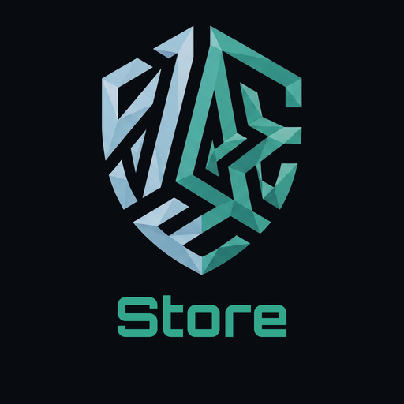
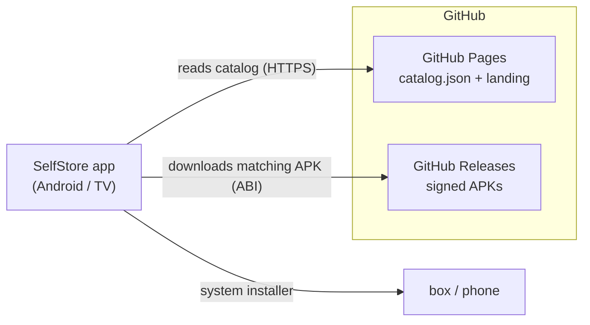
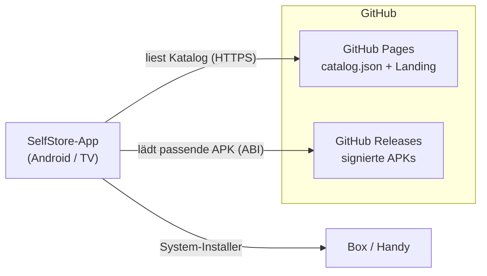

<div align="center">



# SelfStore

**Your own app store for all Self projects — without Google Play.**

Install and update your self-hosted apps straight on your phone and TV box.

[](https://github.com/s3lfcod3r/selfstore/releases/latest)
[](https://store.selfcoder.de/)


[](LICENSE)

[**Open store**](https://store.selfcoder.de/) · [English](#english) · [Deutsch](#deutsch)

</div>

---

## English

### What is SelfStore?

SelfStore is a **lean, self-hosted app store** exclusively for the **Self projects**
(SelfMailer, SelfAuthenticator, SelfDashboard, …). A native Android app reads a fixed
catalog from GitHub Pages and installs/updates the apps directly – ideal for **TV
boxes** that have no Google Play, or where it isn't wanted.

This repository provides the **server side** (catalog + bootstrap landing page) via
GitHub Pages. The Android app's source code is maintained separately and is not part
of this repo.

### ✨ Features

- 📦 **One fixed store** – only your own Self apps, no third-party repos.
- 🔄 **Update detection** – shows *Install · Open · Update* per device state.
- 📺 **TV-ready** – appears on the Android TV home (Leanback), remote-friendly.
- 🧩 **armv7 + armv8** – automatically picks the right APK per box.
- 🌐 **No own server needed** – catalog + APKs run entirely on GitHub.
- 🔒 **Custom sources** – add private app repos (e.g. NextCloud/WebDAV) with username + app password; credentials stored encrypted (Android Keystore), HTTPS only. → [guide](docs/EIGENE-QUELLEN.en.md)
- 🔗 **Add via web** – enter a source in the browser on your PC/phone (`store.selfcoder.de/pair`); the TV box picks it up automatically via a code — no typing on the remote. **End-to-end encrypted** (since v1.5.0): the two-part code `SLOT-KEY` sends only the slot to the service, leaving link and password unreadable to it. → [setup](docs/WEB-KOPPLUNG-SETUP.en.md)
- 📱 **Device filter** – on a TV only TV-capable apps are shown; phone-only apps stay hidden there (catalog field `platforms`).
- 🎨 **Self branding** – consistent Self look (teal, dark).

### 📲 Included apps

The current list lives in [`catalog.json`](catalog.json) and is live at
**<https://store.selfcoder.de/catalog.json>**.

| App | Purpose |
|-----|---------|
| **SelfStore** | The store itself (self-update) |
| **SelfMailer** | Self-hosted mail client (IMAP/POP3/SMTP, calendar) |
| **SelfAuthenticator** | Zero-knowledge 2FA / TOTP vault |
| **SelfDashboard** | Central overview of your Self services |

### 🚀 Install on the TV box

1. Allow **"install unknown apps"** on the box (Settings → Security, or confirm later
   during install).
2. Install the **"Downloader"** app (by AFTVnews) from the box's store.
3. In Downloader, open this address: **`store.selfcoder.de`**
4. Download and install the **SelfStore APK**.
5. Open SelfStore → all Self apps are ready to install / update.

### 🏗️ Architecture


```mermaid
flowchart LR
    subgraph GitHub
      P["GitHub Pages<br/>catalog.json + landing"]
      R["GitHub Releases<br/>signed APKs"]
    end
    A["SelfStore app<br/>(Android / TV)"]
    A -- "reads catalog (HTTPS)" --> P
    A -- "downloads matching APK (ABI)" --> R
    A -- "system installer" --> D["box / phone"]
```

- **Catalog** = static `catalog.json` (this repo, via GitHub Pages).
- **Delivery** = APKs as **GitHub release assets** per app repo.
- **Client** = native Compose app, picks the right APK via `Build.SUPPORTED_ABIS`.

### 📁 Repository contents

```
selfstore/
├── catalog.json              # app list (source of truth)
├── index.html                # bootstrap landing page (Self look)
├── app.js                    # landing logic (renders the catalog XSS-safe)
├── pair/                     # pairing page (DE/EN) + Cloudflare Worker
├── docs/                     # guides, each as NAME.md (DE) + NAME.en.md (EN)
├── icons/                    # app icons (512×512, dark Self background)
├── tools/
│   └── sync_catalog.py       # auto-sync: pulls release versions into catalog.json
├── .github/workflows/
│   └── sync-catalog.yml      # auto-sync workflow (every 15 min + on release)
├── LICENSE                   # MIT
└── .nojekyll                 # GitHub Pages: serve files as-is
```

### ➕ Add an app to the store

Append a block in [`catalog.json`](catalog.json) → `apps`:

```json
{
  "id": "com.example.app",
  "name": "SelfExample",
  "tagline": "Short description",
  "description": "Longer text …",
  "icon": "icons/self-example.png",
  "category": "Tools",
  "author": "SelfCoder",
  "versionName": "1.0.0",
  "versionCode": 1,
  "apk": "https://github.com/s3lfcod3r/<repo>/releases/download/v1.0.0/<file>.apk"
}
```

> ⚠️ **`id` MUST be the real `applicationId`** of the app, otherwise update detection
> won't work. When unsure, read it from the APK:
> `aapt dump badging <app>.apk | findstr package`.
> Bump `versionCode` on **every** update.

### armv7 / armv8

- **Apps without native code** (WebView wrappers, pure Compose apps): a single
  **universal APK** in the `apk` field is enough — runs on armv7 **and** armv8.
- **Apps with native libs** (`.so`): use the `abis` field instead of `apk`:

```json
"abis": {
  "armeabi-v7a": "https://…/app-armeabi-v7a.apk",
  "arm64-v8a":   "https://…/app-arm64-v8a.apk"
}
```

### Release convention (APK file names)

Upload **two assets** per release:

- **`<App>-v<Version>.apk`** (versioned) — linked in the catalog, consistent with the
  other Self apps.
- **`selfstore.apk`** (stable name, this repo only) — so the bootstrap link
  `…/releases/latest/download/selfstore.apk` always works.

> `latest/download/<name>` only works with a **stable** file name; link versioned
> files via `releases/download/<tag>/<file>`.

### 🤖 Automatic catalog sync

A GitHub workflow ([`.github/workflows/sync-catalog.yml`](.github/workflows/sync-catalog.yml))
keeps the **versions of existing apps** up to date automatically: it periodically
(every 15 min, on every release, and manually via *Run workflow*) reads the latest
release of each app repo, pulls `versionCode`/`versionName`/`applicationId` straight
from the release APK, computes its **SHA-256** and updates `catalog.json`. The app
verifies that hash before every installation.

Requirement per entry: a **`"source": "<owner>/<repo>"`** field (ignored by the app).
So for updates: **build APK → upload release → done** — the catalog follows on its own.

> **New apps** still have to be added **once by hand** (name, description, icon, correct
> `id`/`applicationId`, `source`). After that their version updates run automatically.

### 🔧 Build the Android app

Build via the bundled toolchain (no Android Studio needed):

```powershell
$env:JAVA_HOME    = "<TOOLCHAIN>\jdk21"
$env:ANDROID_HOME = "<TOOLCHAIN>\sdk"
& "<TOOLCHAIN>\gradle-8.10.2\bin\gradle.bat" `
    -p "<PATH-TO-APP>" `
    :app:assembleRelease --no-daemon --console=plain
```

→ `app/build/outputs/apk/release/app-release.apk` (release-signed if
`keystore.properties` exists; otherwise debug fallback).

### 🔒 Security

Last reviewed: **August 2026** (code **and** operations). **Hardening applied:**

- **Signature pinning (since v1.5.0):** an APK is installed only if it carries the
  expected signing key. The fingerprints live **inside the app** (`SignerPins.kt`),
  deliberately **not** in the catalog — anyone able to tamper with the catalog would
  simply change an expected value stored there. Apps without a pin (private sources)
  are checked against the signature of the already installed version.
- **Integrity before install:** package name **and** the catalog's SHA-256 are verified
  against the downloaded file; on mismatch it is deleted before the system installer
  ever sees it. The hash is maintained by the auto-sync.
- **Transport:** catalog, APKs and icons **over HTTPS only**, and only from allowed
  hosts (`github.com`, `github.io`, `githubusercontent.com`, your own source hosts).
  The address actually reached **after redirects** is re-checked, so redirects cannot
  bypass the allow-list.
- **End-to-end encrypted web pairing (since v1.5.0):** the TV shows `SLOT-KEY`; only
  the slot reaches the pairing service, while the key part travels solely through the
  user's eyes into the browser. There, link and password are encrypted with AES-256-GCM
  (PBKDF2-HMAC-SHA256, 200,000 rounds) — **the relay only ever sees ciphertext**.
  Unencrypted submissions are rejected.
- **Credentials for custom sources** are stored in `EncryptedSharedPreferences`
  (Android keystore), never in plaintext.
- **Supply chain:** the auto-sync job can write the catalog and the bootstrap APK, so
  GitHub Actions are pinned to **commit SHAs** and the Python dependencies are nailed
  down in `tools/requirements.txt` with `--require-hashes`; the repository's default
  workflow token is `read`.
- **Web pages:** catalog rendering is **XSS-safe** (`textContent` instead of
  `innerHTML`), `https:`-only links, a strict **CSP** with no inline script — including
  the pairing page where passwords are typed — and `referrer: no-referrer`.
- **App manifest:** `allowBackup=false`, FileProvider limited to `cache/downloads` and
  not exported, no cleartext, and **no** `QUERY_ALL_PACKAGES` (a narrow `<queries>` list
  instead, which also avoids Play Protect warnings).

**Knowingly accepted / roadmap:**

- ℹ️ The pairing service runs on Cloudflare — but with end-to-end encryption it is just
  a mailbox with no visibility. Its rate limit is per IP and not atomic.
- ℹ️ Keystore/passwords stay **local only** and are in `.gitignore` — never in the repo.
- ℹ️ GitHub Pages cannot set HTTP headers, so `frame-ancestors` is unavailable by design
  (a meta CSP cannot express it).

Found a security issue? Please report it privately / directly to SelfCoder, not in
public.

### 🌐 Enable GitHub Pages (one-time)

Settings → **Pages** → Source: `Deploy from a branch`, branch `main` / `/ (root)`.
Live after ~1 min at `https://s3lfcod3r.github.io/selfstore/`.

> The app is hard-wired to `…/selfstore/catalog.json` (`CATALOG_URL` in `Catalog.kt`).
> Different path → adjust it there.

---

<div align="center">
<sub>Part of the <b>Self</b> ecosystem · © SelfCoder</sub>
</div>

---

## Deutsch

### Was ist SelfStore?

SelfStore ist ein **schlanker, selbst gehosteter App-Store** ausschließlich für die
**Self-Projekte** (SelfMailer, SelfAuthenticator, SelfDashboard, …). Eine native
Android-App liest einen festen Katalog von GitHub Pages und installiert bzw.
aktualisiert die Apps direkt – ideal für **TV-Boxen**, auf denen es kein Google Play
gibt oder gar nicht erwünscht ist.

Dieses Repository liefert die **Server-Seite** (Katalog + Bootstrap-Landingpage) über
GitHub Pages. Der Quellcode der Android-App wird separat gepflegt und ist nicht Teil
dieses Repos.

### ✨ Features

- 📦 **Ein fester Store** – nur deine eigenen Self-Apps, keine Fremd-Repos.
- 🔄 **Update-Erkennung** – zeigt *Installieren · Öffnen · Aktualisieren* je Gerätelage.
- 📺 **TV-tauglich** – erscheint im Android-TV-Start (Leanback), per Fernbedienung bedienbar.
- 🧩 **armv7 + armv8** – wählt automatisch die passende APK je Box.
- 🌐 **Kein eigener Server nötig** – Katalog + APKs laufen komplett über GitHub.
- 🔒 **Eigene Quellen** – private App-Repos (z. B. NextCloud/WebDAV) mit Benutzer + App-Passwort einbinden; Zugangsdaten verschlüsselt gespeichert (Android-Keystore), nur HTTPS. → [Anleitung](docs/EIGENE-QUELLEN.md)
- 🔗 **Per Web hinzufügen** – Quelle am PC/Handy im Browser (`store.selfcoder.de/pair`) eingeben; die TV-Box übernimmt sie per Code automatisch, kein Tippen auf der Fernbedienung. **Ende-zu-Ende verschlüsselt** (ab v1.5.0): der zweiteilige Code `SLOT-SCHLUESSEL` schickt nur den Slot an den Dienst, Link und Passwort bleiben für ihn unlesbar. → [Einrichtung](docs/WEB-KOPPLUNG-SETUP.md)
- 📱 **Geräte-Filter** – auf dem Fernseher erscheinen nur TV-taugliche Apps; reine Handy-Apps bleiben dort ausgeblendet (Katalog-Feld `platforms`).
- 🎨 **Self-Branding** – durchgängig im Self-Look (Teal, dark).

### 📲 Enthaltene Apps

Die aktuelle Liste steht in [`catalog.json`](catalog.json) und ist live unter
**<https://store.selfcoder.de/catalog.json>**.

| App | Zweck |
|-----|-------|
| **SelfStore** | Der Store selbst (self-update) |
| **SelfMailer** | Self-hosted Mail-Client (IMAP/POP3/SMTP, Kalender) |
| **SelfAuthenticator** | Zero-Knowledge 2FA-/TOTP-Tresor |
| **SelfDashboard** | Zentrale Übersicht über deine Self-Dienste |

### 🚀 Installation auf der TV-Box

1. Auf der Box **„Unbekannte Apps zulassen"** erlauben (Einstellungen → Sicherheit,
   bzw. später beim Installieren bestätigen).
2. Die App **„Downloader"** (von AFTVnews) aus dem Box-Store installieren.
3. In Downloader diese Adresse öffnen: **`store.selfcoder.de`**
4. **SelfStore-APK** herunterladen und installieren.
5. SelfStore öffnen → alle Self-Apps stehen zum Installieren / Aktualisieren bereit.

### 🏗️ Architektur


```mermaid
flowchart LR
    subgraph GitHub
      P["GitHub Pages<br/>catalog.json + Landing"]
      R["GitHub Releases<br/>signierte APKs"]
    end
    A["SelfStore-App<br/>(Android / TV)"]
    A -- "liest Katalog (HTTPS)" --> P
    A -- "lädt passende APK (ABI)" --> R
    A -- "System-Installer" --> D["Box / Handy"]
```

- **Katalog** = statisches `catalog.json` (dieses Repo, via GitHub Pages).
- **Auslieferung** = APKs als **GitHub-Release-Assets** je App-Repo.
- **Client** = native Compose-App, wählt per `Build.SUPPORTED_ABIS` die richtige APK.

### 📁 Repository-Inhalt

```
selfstore/
├── catalog.json              # App-Liste (Quelle der Wahrheit)
├── index.html                # Bootstrap-Landingpage (Self-Look)
├── app.js                    # Landing-Logik (rendert den Katalog XSS-sicher)
├── pair/                     # Kopplungsseite (DE/EN) + Cloudflare Worker
├── docs/                     # Anleitungen, je NAME.md (DE) + NAME.en.md (EN)
├── icons/                    # App-Icons (512×512, dunkler Self-Hintergrund)
├── tools/
│   └── sync_catalog.py       # Auto-Sync: zieht Release-Versionen in catalog.json
├── .github/workflows/
│   └── sync-catalog.yml      # Auto-Sync (alle 15 Min + bei jedem Release)
├── LICENSE                   # MIT
└── .nojekyll                 # GitHub Pages: Dateien unverändert ausliefern
```

### ➕ Eine App in den Store legen

Block in [`catalog.json`](catalog.json) → `apps` anhängen:

```json
{
  "id": "com.beispiel.app",
  "name": "SelfBeispiel",
  "tagline": "Kurzbeschreibung",
  "description": "Längerer Text …",
  "icon": "icons/self-beispiel.png",
  "category": "Tools",
  "author": "SelfCoder",
  "versionName": "1.0.0",
  "versionCode": 1,
  "apk": "https://github.com/s3lfcod3r/<repo>/releases/download/v1.0.0/<datei>.apk"
}
```

> ⚠️ **`id` MUSS die echte `applicationId`** der App sein, sonst funktioniert die
> Update-Erkennung nicht. Im Zweifel aus der APK auslesen:
> `aapt dump badging <app>.apk | findstr package`.
> `versionCode` bei **jedem** Update hochzählen.

### armv7 / armv8

- **Apps ohne Native-Code** (WebView-Wrapper, reine Compose-Apps): ein
  **Universal-APK** im Feld `apk` reicht — läuft auf armv7 **und** armv8.
- **Apps mit Native-Libs** (`.so`): statt `apk` das Feld `abis` nutzen:

```json
"abis": {
  "armeabi-v7a": "https://…/app-armeabi-v7a.apk",
  "arm64-v8a":   "https://…/app-arm64-v8a.apk"
}
```

### Release-Konvention (APK-Dateinamen)

Pro Release **zwei Assets** hochladen:

- **`<App>-v<Version>.apk`** (versioniert) — wird im Katalog verlinkt, einheitlich
  mit den anderen Self-Apps.
- **`selfstore.apk`** (stabiler Name, nur dieses Repo) — damit der Bootstrap-Link
  `…/releases/latest/download/selfstore.apk` immer funktioniert.

> `latest/download/<name>` klappt nur mit **stabilem** Dateinamen; versionierte
> Dateien per `releases/download/<tag>/<datei>` verlinken.

### 🤖 Automatischer Katalog-Sync

Ein GitHub-Workflow ([`.github/workflows/sync-catalog.yml`](.github/workflows/sync-catalog.yml))
hält die **Versionen bestehender Apps** automatisch aktuell: er liest periodisch
(alle 15 Min, bei jedem Release und manuell per *Run workflow*) das neueste Release
jedes App-Repos, zieht `versionCode`/`versionName`/`applicationId` direkt aus dem
Release-APK, berechnet dessen **SHA-256** und aktualisiert `catalog.json`. Den Hash
prüft die App vor jeder Installation.

Voraussetzung je Eintrag: ein Feld **`"source": "<owner>/<repo>"`** (von der App
ignoriert). Damit gilt für Updates: **APK bauen → Release hochladen → fertig** — der
Katalog zieht von selbst nach.

> **Neue Apps** müssen weiterhin **einmalig von Hand** angelegt werden (Name,
> Beschreibung, Icon, korrekte `id`/`applicationId`, `source`). Danach laufen ihre
> Versions-Updates automatisch.

### 🔧 Android-App bauen

Build über die mitgelieferte Toolchain (kein Android Studio nötig):

```powershell
$env:JAVA_HOME    = "<TOOLCHAIN>\jdk21"
$env:ANDROID_HOME = "<TOOLCHAIN>\sdk"
& "<TOOLCHAIN>\gradle-8.10.2\bin\gradle.bat" `
    -p "<PFAD-ZUR-APP>" `
    :app:assembleRelease --no-daemon --console=plain
```

→ `app/build/outputs/apk/release/app-release.apk` (Release-signiert, sofern
`keystore.properties` vorhanden ist; sonst Debug-Fallback).

### 🔒 Security

Zuletzt geprüft: **August 2026** (Code **und** Betrieb). **Umgesetzte Härtungen:**

- **Signatur-Pinning (ab v1.5.0):** Eine APK wird nur installiert, wenn sie mit dem
  erwarteten Schlüssel signiert ist. Die Fingerabdrücke stecken **fest in der App**
  (`SignerPins.kt`), bewusst **nicht** im Katalog — wer den Katalog manipulieren
  könnte, würde einen dort hinterlegten Wert sonst einfach mitändern. Apps ohne Pin
  (private Quellen) werden gegen die Signatur der installierten Version geprüft.
- **Integrität vor der Installation:** Paketname **und** SHA-256 aus dem Katalog
  werden gegen die heruntergeladene Datei geprüft; bei Abweichung wird sie gelöscht,
  bevor der System-Installer sie zu sehen bekommt. Den Hash pflegt der Auto-Sync.
- **Transport:** Katalog, APKs und Icons **ausschließlich über HTTPS** und nur von
  erlaubten Hosts (`github.com`, `github.io`, `githubusercontent.com`, eigene
  Quell-Hosts). Auch die **nach Weiterleitungen** tatsächlich erreichte Adresse wird
  erneut geprüft — Redirects können die Freigabe nicht umgehen.
- **Web-Kopplung Ende-zu-Ende verschlüsselt (ab v1.5.0):** Der Fernseher zeigt
  `SLOT-SCHLUESSEL`; nur der Slot erreicht den Pairing-Dienst, der Schlüsselteil
  gelangt ausschließlich über die Augen des Nutzers in den Browser. Dort werden Link
  und Passwort mit AES-256-GCM verschlüsselt (PBKDF2-HMAC-SHA256, 200 000 Runden) —
  **der Relay-Betreiber sieht nur Geheimtext**. Unverschlüsselte Beiträge lehnt der
  Dienst ab.
- **Zugangsdaten eigener Quellen** liegen in `EncryptedSharedPreferences`
  (Android-Keystore), nie im Klartext.
- **Lieferkette:** Der Auto-Sync-Job hat Schreibrechte auf Katalog und Bootstrap-APK,
  deshalb sind GitHub Actions auf **Commit-SHA** gepinnt und die Python-Abhängigkeiten
  über `tools/requirements.txt` mit `--require-hashes` festgenagelt; das
  Standard-Token des Repos steht auf `read`.
- **Webseiten:** Katalog-Rendering **XSS-sicher** (`textContent` statt `innerHTML`),
  nur `https:`-Links, strikte **CSP** ohne Inline-Skript — auch auf der
  Pairing-Seite, auf der Passwörter eingegeben werden — und `referrer: no-referrer`.
- **App-Manifest:** `allowBackup=false`, FileProvider auf `cache/downloads` beschränkt
  und nicht exportiert, kein Cleartext, **kein** `QUERY_ALL_PACKAGES` (stattdessen
  enge `<queries>`-Liste, das vermeidet auch Play-Protect-Warnungen).

**Bewusst akzeptiert / Roadmap:**

- ℹ️ Der Pairing-Dienst läuft bei Cloudflare — durch die Verschlüsselung ist er aber
  nur noch ein Briefkasten ohne Einsicht. Sein Rate-Limit ist pro IP und nicht atomar.
- ℹ️ Keystore/Passwörter liegen **nur lokal** und sind in `.gitignore` — niemals im Repo.
- ℹ️ Auf GitHub Pages lassen sich keine HTTP-Header setzen; `frame-ancestors` fehlt
  deshalb systembedingt (Meta-CSP kann das nicht abbilden).

Sicherheitslücke gefunden? Bitte als privates Issue / direkt an SelfCoder melden,
nicht öffentlich posten.

### 🌐 GitHub Pages aktivieren (einmalig)

Settings → **Pages** → Source: `Deploy from a branch`, Branch `main` / `/ (root)`.
Live nach ~1 Min unter `https://s3lfcod3r.github.io/selfstore/`.

> Die App ist fest auf `…/selfstore/catalog.json` verdrahtet (`CATALOG_URL` in
> `Catalog.kt`). Anderer Pfad → dort anpassen.

---

<div align="center">
<sub>Teil des <b>Self</b>-Ökosystems · © SelfCoder</sub>
</div>
